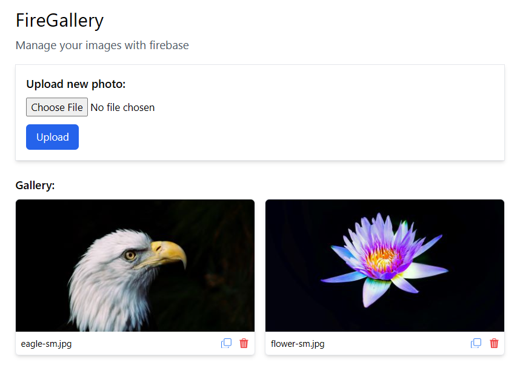

# FireGallery - demo

An image gallery web application to manage images (like postimages). We can upload local image into cloud, delete it, copy it, see live gallery etc. 

**Tech**: react 18, tailwindcss, firebase (storage, realtime-db), bootstrap-icons

This project is developed and designed by *Rahat Faruk* (me). I wanted to explore more about react and firebase through this project.  

*Note: This GitHub repository contains some demo code of my full project*

### Related article:
Read my article: [how to upload an image into firebase programatically](https://dev.to/rahatfaruk/how-to-upload-an-image-into-firebase-storage-58cl) 